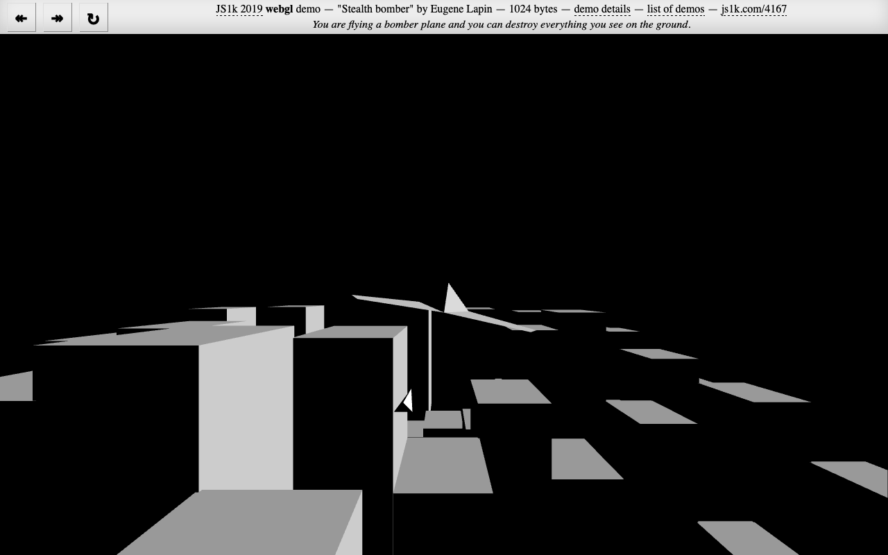

## Stealth bomber - 1K JavaScript webgl demo

3D shooting game for [JS1k](http://js1k.com/) code golfing
competition. You are flying a bomber plane and you can destroy everything you see on the ground.

The demo entry can be seen on the JS1k [website](https://js1k.com/4167) or built from source code.

Build dependencies:
* bash
* Node.js

### Quick start
```
$ git clone git@github.com:kolduras/stealth-2019.git
$ cd stealth-2019
$ npm install && npm start
```